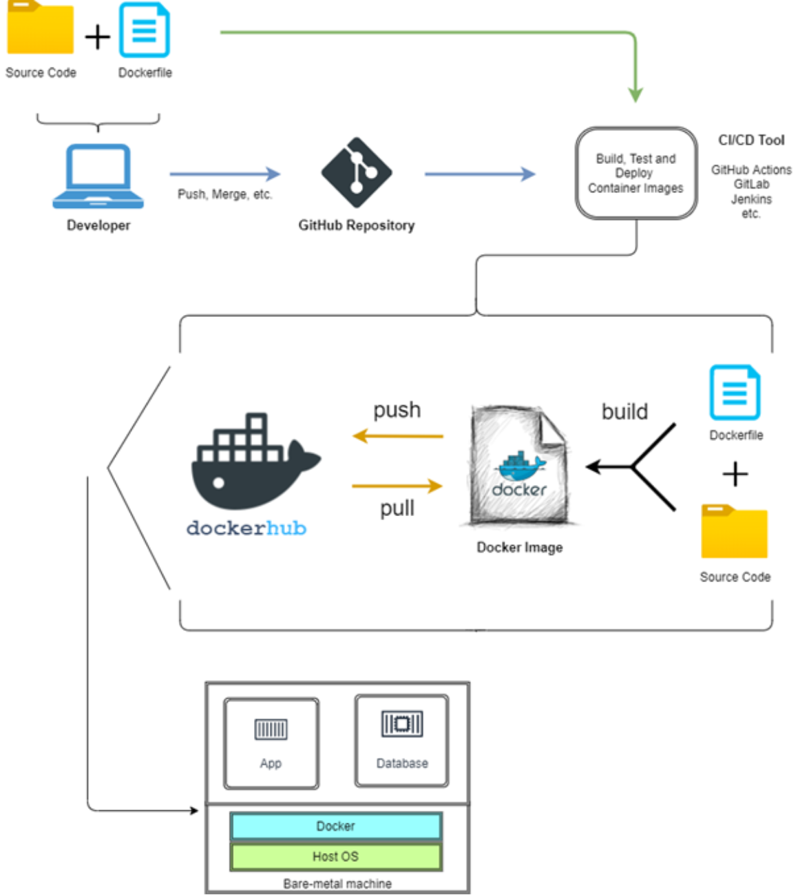

# Deploying Microservices over Docker Containers
## CSE8090 Graduation Project

We automated the deployment process of a simple to-do web application.

### Technologies used: 
- Docker
- Docker Compose
- Github Actions
- MongoDB
- Node.js

See our comprehensive [report](https://drive.google.com/file/d/1SveC5KR-IiXLhLJ_UFvymiBPuJBbrnRM/view?usp=sharing) for more information. 

&nbsp;  

